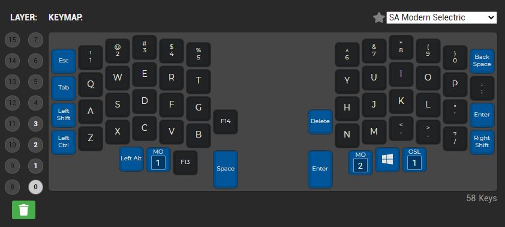
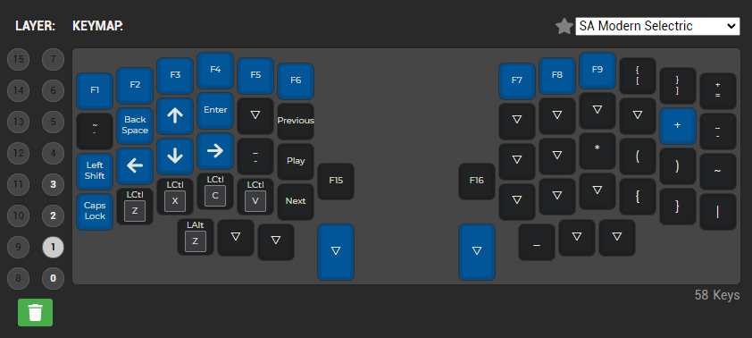

# My custom keymapping

## Layer 0

---

## Layer 1

---

This readme serves as a quick reference, keymapping and configurations are saved here after firmware is compiled.

Files saved:

- keymap.c
- rules.mk
- JSON configuration for QMK
